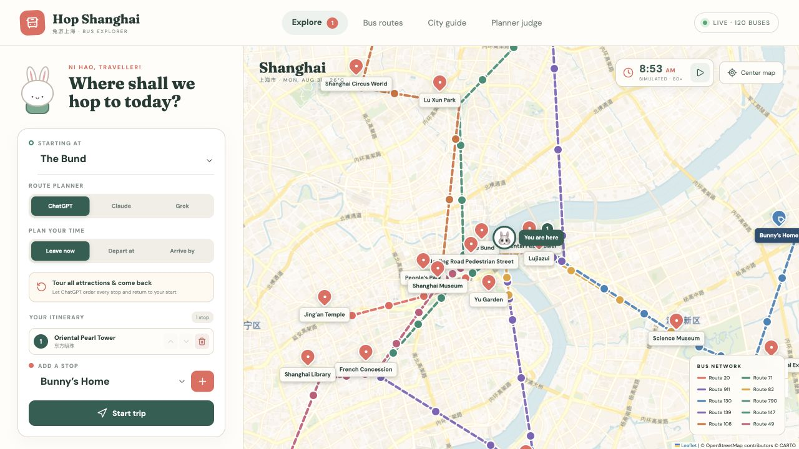

# 🐰 Hop Shanghai

Explore Shanghai with Bunny: plan bus journeys, discover attractions, and compare three route-planning algorithms on an interactive map.

**[Open the live app](https://shanghai-bus-system-929315648024.us-west1.run.app/)**



*Screenshot from the local app with a configured CARTO basemap key.*

## Explore the app

- **Trip planner:** choose a starting point, add and reorder stops, or take a full city tour that returns to the start. Select Leave now, Depart at, or Arrive by.
- **Follow Bunny:** see her bus, next stop, transfer instructions, and waiting time. The simulation speeds up during trips and pauses for boarding and sightseeing.
- **Bus routes:** browse the active network's routes, stops, and displayed schedules. Dataset changes in Planner Judge also update this view and the map.
- **City guide:** explore Shanghai attractions with photos, descriptions, and visiting tips.
- **Planner Judge:** generate networks with 10, 50, or 100 routes and compare ChatGPT, Claude, and Grok planners against the same randomized trips.

The places are real, but the bus network, timetables, vehicle positions, and journey times are fictional simulations—not live transit information. The planners are JavaScript algorithms running in your browser; using them does not call AI APIs.

## How planning works

All three planners use schedule-aware searches for a fixed itinerary, accounting for boarding waits, rides, and sightseeing stops. They differ in how they choose a round-trip visiting order:

- **ChatGPT:** starts with nearest-neighbor and 2-opt, times both directions, then explores additional orders within a search budget.
- **Claude:** times both directions of a nearest-neighbor and 2-opt tour.
- **Grok:** times both directions of two constructions: cheapest-insertion with 3-opt, and nearest-neighbor with 2-opt.

The judge scores complete, legal trips by total time, with fewer line changes breaking ties. Wins include ties; results vary with the network, departure time, and requested stops.

## Run locally

Use Node.js 24 and npm.

```sh
git clone https://github.com/wshxzt/shanghai-bus-system.git
cd shanghai-bus-system
npm ci
npm run dev
```

Open the local URL printed by Vite, usually [localhost:5173](http://localhost:5173).

### Basemap configuration

For a configured CARTO basemap, copy `.env.example` to `.env.local` and set `VITE_CARTO_BASEMAP_KEY` to your key. Restart Vite after changing it. Without a valid key, tiles may show an “API key required” watermark.

Vite embeds `VITE_*` values in the browser bundle at build time. A Cloud Run runtime environment variable alone will not configure the map. The included deployment excludes `.env` files, so a production basemap key must be supplied separately during the build. Never put server-side secrets in `VITE_*` variables.

## Test and build

```sh
npm test
npm run build
```

Tests cover routing, timetable behavior, transfer counting, tour ordering, and journey animation timing. Vite writes the production site to `dist/`.

## Deploy to Cloud Run

The Dockerfile builds and tests the app with Node.js, then serves the static output through Nginx on port 8080. With Google Cloud CLI installed, authenticated, and a billing-enabled project configured:

```sh
gcloud run deploy shanghai-bus-system \
  --source . \
  --project YOUR_PROJECT_ID \
  --region us-west1 \
  --allow-unauthenticated \
  --port 8080 \
  --cpu 1 \
  --memory 256Mi \
  --min-instances 0 \
  --max-instances 3
```

This creates a public service that scales to zero when idle. Cloud Build, Artifact Registry, and Cloud Run usage may incur charges.

## Project layout

- `src.jsx` — app views, map, and trip controls.
- `route-planners/` — ChatGPT, Claude, and Grok algorithms.
- `schedule.js` — shared timetable model and trip timeline simulation.
- `journey.js` — boarding groups and Bunny's position along a journey.
- `PlannerJudgeView.jsx` — network generation, benchmarks, and route reports.
- `tests/` — Node.js tests.
- `public/assets/` — attraction images.
- `Dockerfile` and `nginx.conf` — Cloud Run container configuration.

Built with React, Vite, Leaflet, and Lucide icons. Basemap tiles are provided by CARTO with OpenStreetMap contributors credited on the map.
